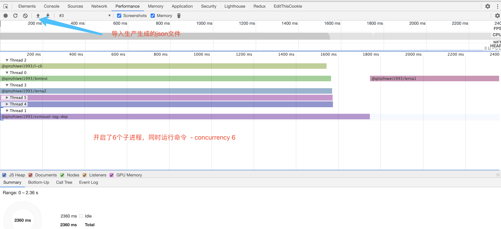
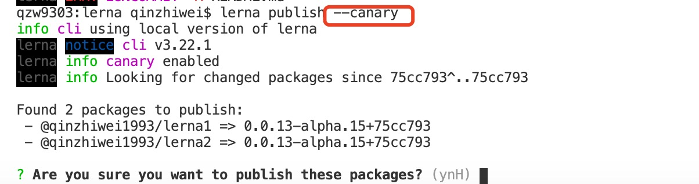
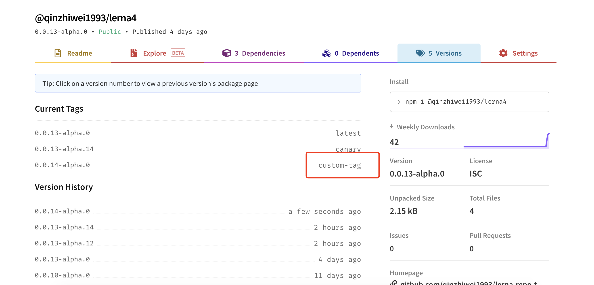
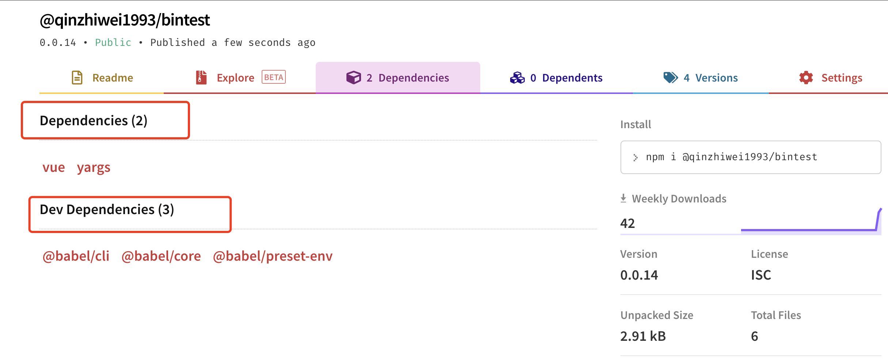
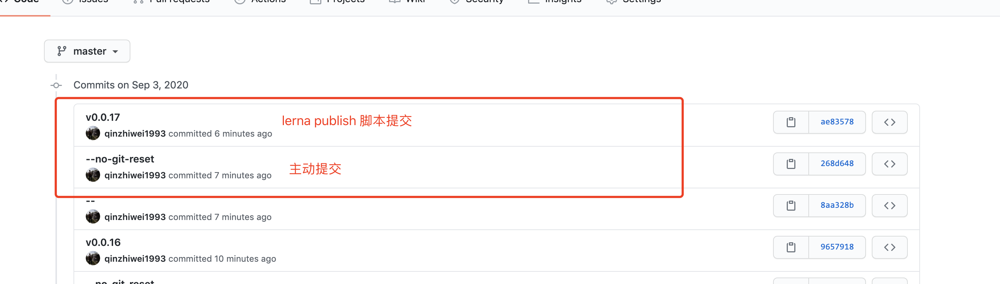
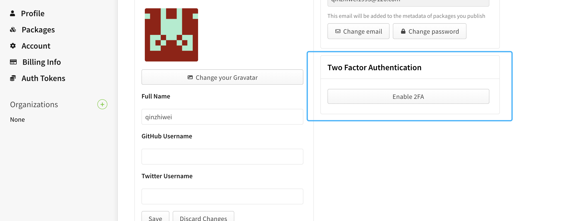

# lerna

Lerna 是一个工具，它优化了使用 git 和 npm 管理多包存储库的工作流

## 背景

1.将一个大的 package 分割成一些小的 packcage 便于分享

2.在多个 git 仓库中更改容易变得混乱且难以跟踪

3.在多个 git 仓库中维护测试繁琐

## 优点

- 各个包相互独立，便于发版、分享
- 在同一个存储库便于调试

---

## 两种工作模式

### Fixed/Locked mode (default)

vue,babel 都是用这种，在 publish 的时候,所有的包版本都会更新，并且包的版本都是一致的，版本号维护在 lerna.jon 的 version 中

### Independent mode

`lerna init --independent`

独立模式，每个 package 都可以有自己的版本号。版本号维护在各自 package.json 的 version 中。每次发布前都会提示已经更改的包，以及建议的版本号或者自定义版本号。这种方式相对第一种来说，更灵活

## 初始化项目

```javascript
npm install -g lerna // 这里是全局安装，也可以安装为项目开发依赖，使用全局方便后期使用命令行
mkdir lerna-repo
cd lerna-repo
lerna init // 初始化一个lerna项目结构，如果希望各个包使用单独版本号可以加 -i | --independent
```

## 标准的 lerna 目录结构

- 每个单独的包下都有一个 package.json 文件
- 如果包名是带 scope 的，例如@test/lerna，package.json 中，必须配置"publishConfig": {"access": "public"}

```
my-lerna-repo/
  package.json
  lerna.json
  LICENSE
  packages/
    package-1/
      package.json
    package-2/
      package.json
```

## 启用 yarn Workspaces （强烈建议）

Workspaces can only be enabled in private projects.

默认是 npm, 每个子 package 下都有自己的 node_modules，通过这样设置后，会把所有的依赖提升到顶层的 node_modules 中，并且在 node_modules 中链接本地的 package，便于调试

**注意**：必须是 private 项目才可以开启 workspaces

```json
// package.json

"private": true,
  "workspaces": [
    "packages/*"
  ],

// lerna.json

"useWorkspaces": true,
"npmClient": "yarn",
```

## 常用命令

### [lerna init](https://github.com/lerna/lerna/blob/master/commands/init#readme)

初始化 lerna 项目

- -i, --independent 独立版本模式

### [lerna create <name> [loc]](https://github.com/lerna/lerna/blob/master/commands/create#readme)

创建一个 packcage

- `--access` When using a scope, set publishConfig.access value [可选值: "public", "restricted"][默认值: public]
- `--bin` Package has an executable. Customize with --bin <executableName>
- `--description` Package description [字符串]
- `--dependencies` A list of package dependencies [数组]
- `--es-module` Initialize a transpiled ES Module [布尔]
- `--homepage` The package homepage, defaulting to a subpath of the root pkg.homepage [字符串]
- `--keywords` A list of package keywords [数组]
- `--license` The desired package license (SPDX identifier) [字符串][默认值: isc]
- `--private` Make the new package private, never published to any external registry [布尔]
- `--registry` Configure the package's publishConfig.registry [字符串]
- `--tag` Configure the package's publishConfig.tag [字符串]
- `-y, --yes` Skip all prompts, accepting default values [布尔]


### [lerna add](https://github.com/lerna/lerna/tree/master/commands/add#readme)

为匹配的package添加本地或者远程依赖，一次只能添加一个依赖

```sh
$ lerna add <package>[@version] [--dev] [--exact] [--peer]
```

运行该命令时做的事情:

1. 为匹配到的package添加依赖
2. 更改每个package下的package.json中的依赖项属性


#### Command Options

以下几个选项的含义和`npm install`时一致
- `--dev`
- `--exact`
- `--peer`
- `--registry <url>`
- `--no-bootstrap`  跳过 `lerna bootstrap`，只在更改对应的package的package.json中的属性

[`所有的过滤选项都支持`](#过滤选项)

## Examples

```sh
# Adds the module-1 package to the packages in the 'prefix-' prefixed folders
lerna add module-1 packages/prefix-*

# Install module-1 to module-2
lerna add module-1 --scope=module-2

# Install module-1 to module-2 in devDependencies
lerna add module-1 --scope=module-2 --dev

# Install module-1 to module-2 in peerDependencies
lerna add module-1 --scope=module-2 --peer

# Install module-1 in all modules except module-1
lerna add module-1

# Install babel-core in all modules
lerna add babel-core
```


### [lerna bootstrap](https://github.com/lerna/lerna/blob/master/commands/bootstrap#readme)

将本地 package 链接在一起并安装依赖

执行该命令式做了一下四件事：

1.为每个 package 安装依赖 2.链接相互依赖的库到具体的目录，例如：如果 lerna1 下有 lerna2，且版本刚好为本地版本，那么会在 node_modules 中链接本地项目，如果版本不满足，需按正常依赖安装 3.在 bootstraped packages 中 执行 `npm run prepublish` 4.在 bootstraped packages 中 执行 `npm run prepare`

#### Command Options

- `--hoist` 匹配 [glob] 依赖 提升到根目录 [默认值: '**'], 包含可执行二进制文件的依赖项还是必须安装在当前 package 的 node_modules 下，以确保 npm 脚本的运行
- `--nohoist` 和上面刚好相反 [字符串]
- `--ignore-prepublish` 在 bootstraped packages 中不再运行 prepublish 生命周期中的脚本 [布尔]
- `--ignore-scripts` 在 bootstraped packages 中不再运行任何生命周期中的脚本 [布尔]
- `--npm-client` 使用的 npm 客户端(npm, yarn, pnpm, ...) [字符串]
- `--registry` 为 npm 设置 registry [字符串]
- `--strict` 在 bootstrap 的过程中不允许发出警告，避免花销更长的时间或者导致其他问题 [布尔]
- `--use-workspaces` 启用 yarn 的 workspaces 模式 [布尔]
- `--force-local` 无论版本范围是否匹配，强制本地同级链接 [布尔] ?
- `--contents` 子目录用作任何链接的源。必须适用于所有包装 [字符串][默认值: .] ?


### [lerna link](https://github.com/lerna/lerna/tree/master/commands/link#readme)

将本地相互依赖的package相互连接。例如lerna1依赖lerna2，且版本号刚好为本地的lerna2，那么会在lerna1下node_modules中建立软连指向lerna2

#### Command Options

- --force-local 无论本地package是否满足版本需求，都链接本地的


```json
// 指定软链到package的特定目录
"publishConfig": {
    "directory": "dist" // bootstrap的时候软链package下的dist目录 package-1/dist => node_modules/package-1
  }
```


### [lerna list](https://github.com/lerna/lerna/tree/master/commands/list#readme)

#### list子命令

- `lerna ls`: 等同于 `lerna list`本身，输出项目下所有的package
- `lerna ll`: 输出项目下所有package名称、当前版本、所在位置
- `lerna la`: 输出项目下所有package名称、当前版本、所在位置，包括private package

#### Command Options

- [`--json`](#--json)
- [`--ndjson`](#--ndjson)
- [`-a`, `--all`](#--all)
- [`-l`, `--long`](#--long) 
- [`-p`, `--parseable`](#--parseable)
- [`--toposort`](#--toposort)
- [`--graph`](#--graph)

[`所有的过滤选项都支持`](#过滤选项)

##### `--json`

以json形式展示

```sh
$ lerna ls --json
[
  {
    "name": "package-1",
    "version": "1.0.0",
    "private": false,
    "location": "/path/to/packages/pkg-1"
  },
  {
    "name": "package-2",
    "version": "1.0.0",
    "private": false,
    "location": "/path/to/packages/pkg-2"
  }
]
```

#### `--ndjson`

以[newline-delimited JSON](http://ndjson.org/)展示信息

```sh
$ lerna ls --ndjson
{"name":"package-1","version":"1.0.0","private":false,"location":"/path/to/packages/pkg-1"}
{"name":"package-2","version":"1.0.0","private":false,"location":"/path/to/packages/pkg-2"}
```

#### `--all`

Alias: `-a`

显示默认隐藏的private package

```sh
$ lerna ls --all
package-1
package-2
package-3 (private)
```

#### `--long`

Alias: `-l`

显示包的版本、位置、名称

```sh
$ lerna ls --long
package-1 v1.0.1 packages/pkg-1
package-2 v1.0.2 packages/pkg-2

$ lerna ls -la
package-1 v1.0.1 packages/pkg-1
package-2 v1.0.2 packages/pkg-2
package-3 v1.0.3 packages/pkg-3 (private)
```

#### `--parseable`

Alias: `-p`

显示包的绝对路径

In `--long` output, each line is a `:`-separated list: `<fullpath>:<name>:<version>[:flags..]`

```sh
$ lerna ls --parseable
/path/to/packages/pkg-1
/path/to/packages/pkg-2

$ lerna ls -pl
/path/to/packages/pkg-1:package-1:1.0.1
/path/to/packages/pkg-2:package-2:1.0.2

$ lerna ls -pla
/path/to/packages/pkg-1:package-1:1.0.1
/path/to/packages/pkg-2:package-2:1.0.2
/path/to/packages/pkg-3:package-3:1.0.3:PRIVATE
```

#### `--toposort`

按照拓扑顺序(dependencies before dependents)对包进行排序，而不是按目录对包进行词法排序。

```sh
$ json dependencies <packages/pkg-1/package.json
{
  "pkg-2": "file:../pkg-2"
}

$ lerna ls --toposort
package-2
package-1
```

#### `--graph`

将依赖关系图显示为JSON格式的邻接表 [adjacency list](https://en.wikipedia.org/wiki/Adjacency_list).

```sh
$ lerna ls --graph
{
  "pkg-1": [
    "pkg-2"
  ],
  "pkg-2": []
}

$ lerna ls --graph --all
{
  "pkg-1": [
    "pkg-2"
  ],
  "pkg-2": [
    "pkg-3"
  ],
  "pkg-3": [
    "pkg-2"
  ]
}
```

### [lerna changed](https://github.com/lerna/lerna/tree/master/commands/changed#readme)

列出自上次发布（打tag）以来本地发生变化的package


**注意:** `lerna publish`和`lerna version`的`lerna.json`配置同样影响`lerna changed`。 例如 `command.publish.ignoreChanges`.

#### Command Options

`lerna changed` 支持 [`lerna ls`](https://github.com/lerna/lerna/tree/master/commands/list#options)的所有标记：

- [`--json`](https://github.com/lerna/lerna/tree/master/commands/list#--json)
- [`--ndjson`](https://github.com/lerna/lerna/tree/master/commands/list#--ndjson)
- [`-a`, `--all`](https://github.com/lerna/lerna/tree/master/commands/list#--all)
- [`-l`, `--long`](https://github.com/lerna/lerna/tree/master/commands/list#--long)
- [`-p`, `--parseable`](https://github.com/lerna/lerna/tree/master/commands/list#--parseable)
- [`--toposort`](https://github.com/lerna/lerna/tree/master/commands/list#--toposort)
- [`--graph`](https://github.com/lerna/lerna/tree/master/commands/list#--graph)

lerna不支持[过滤选项](https://www.npmjs.com/package/@lerna/filter-options), 因为`lerna version` or `lerna publish`不支持过滤选项.

`lerna changed` 支持 [`lerna version`](https://github.com/lerna/lerna/tree/master/commands/version#options) (the others are irrelevant)的过滤选项：

- [`--conventional-graduate`](https://github.com/lerna/lerna/tree/master/commands/version#--conventional-graduate).
- [`--force-publish`](https://github.com/lerna/lerna/tree/master/commands/version#--force-publish).
- [`--ignore-changes`](https://github.com/lerna/lerna/tree/master/commands/version#--ignore-changes).
- [`--include-merged-tags`](https://github.com/lerna/lerna/tree/master/commands/version#--include-merged-tags).


### `lerna version`


### [lerna import](https://github.com/lerna/lerna/tree/master/commands/import#readme)

`lerna import <path-to-external-repository>`

将现有的package收集到lerna项目中。可以保留之前的原始提交作者，日期和消息将保留。 

**注意**：如果要在一个新的lerna中引入，必须至少有个commit

#### Command Options

- `--flatten` 处理合并冲突
- `--dest` 指定引入包的目录
- `--preserve-commit` 保持引入项目原有的提交者信息

### [lerna clean](https://github.com/lerna/lerna/tree/master/commands/clean#readme)

`lerna clean`

移除所有packages下的node_modules，并不会移除根目录下的
[`所有的过滤选项都支持`](#过滤选项)

### [lerna diff](https://github.com/lerna/lerna/tree/master/commands/diff#readme)

查看自上次发布（打tag）以来某个package或者所有package的变化

```sh
$ lerna diff [package]

$ lerna diff
# diff a specific package
$ lerna diff package-name
```

> Similar to `lerna changed`. This command runs `git diff`.


### [lerna exec](https://github.com/lerna/lerna/tree/master/commands/exec#readme)

在每个package中执行任意命令，用波折号(`--`)分割命令语句

#### 使用方式

```sh
$ lerna exec -- <command> [..args] # runs the command in all packages
$ lerna exec -- rm -rf ./node_modules
$ lerna exec -- protractor conf.js
```

可以通过`LERNA_PACKAGE_NAME`变量获取当前package名称：

```sh
$ lerna exec -- npm view \$LERNA_PACKAGE_NAME
```

也可以通过`LERNA_ROOT_PATH`获取根目录绝对路径：

```sh
$ lerna exec -- node \$LERNA_ROOT_PATH/scripts/some-script.js
```

#### Command Options

[`所有的过滤选项都支持`](#过滤选项)

```sh
$ lerna exec --scope my-component -- ls -la
```

- --concurrenty

> 使用给定的数量进行并发执行(除非指定了 `--parallel`)。
> 输出是经过管道过滤，存在不确定性。
> 如果你希望命令一个接着一个执行，可以使用如下方式：

```sh
$ lerna exec --concurrency 1 -- ls -la
```

- `--stream`

从子进程立即输出，前缀是包的名称。该方式允许交叉输出：

```sh
$ lerna exec --stream -- babel src -d lib
```


- `--parallel`

和`--stream`很像。但是完全忽略了并发性和排序，立即在所有匹配的包中运行给定的命令或脚本。适合长时间运行的进程。例如处于监听状态的`babel src -d lib -w`

```sh
$ lerna exec --parallel -- babel src -d lib -w
```

> **注意:** 建议使用命令式控制包的范围。
> 因为过多的进程可能会损害`shell`的稳定。例如最大文件描述符限制

- `--no-bail`

```sh
# Run a command, ignoring non-zero (error) exit codes
$ lerna exec --no-bail <command>
```

默认情况下，如果一但出现命令报错就会退费进程。使用该命令会禁止此行为，跳过改报错行为，继续执行其他命令

- `--no-prefix`

在输出中不显示package的名称

- `--profile`

生成一个json文件，可以在chrome浏览器（`devtools://devtools/bundled/devtools_app.html`）查看性能分析。通过配置`--concurrenty`可以开启固定数量的子进程数量



```sh
$ lerna exec --profile -- <command>
```

> **注意:** 仅在启用拓扑排序时分析。不能和 `--parallel` and `--no-sort`一同使用。

- `--profile-location <location>`

设置分析文件存放位置

```sh
$ lerna exec --profile --profile-location=logs/profile/ -- <command>
```

### [lerna run](https://github.com/lerna/lerna/tree/master/commands/run#readme)

在每个package中运行npm脚本

#### 使用方法

```sh
$ lerna run <script> -- [..args] # runs npm run my-script in all packages that have it
$ lerna run test
$ lerna run build

# watch all packages and transpile on change, streaming prefixed output
$ lerna run --parallel watch
```


#### Command Options 

- `--npm-client <client>`

设置`npm`客户端，默认是`npm`

```sh
$ lerna run build --npm-client=yarn
```

也可以在`lerna.json`配置:

```json
{
  "command": {
    "run": {
      "npmClient": "yarn"
    }
  }
}
```

- 其余同`lerna exec`


### [lerna version](https://github.com/lerna/lerna/tree/master/commands/version#readme)

> 生成新的唯一版本号
> bumm version：在使用类似github程序时，升级版本号到一个新的唯一值

## Usage

```sh
lerna version 1.0.1 # 显示指定
lerna version patch # 语义关键字
lerna version       # 从提示中选择
```

当执行时，该命令做了一下事情:

1.识别从上次打标记发布以来发生变更的package
2.版本提示
3.修改package的元数据反映新的版本，在根目录和每个package中适当运行[lifecycle scripts](#lifecycle-scripts)
4.在git上提交改变并对该次提交打标记(`git commit` & `git tag`)
5.提交到远程仓库(`git push`)

## Positionals

### semver `bump`

```sh
lerna version [major | minor | patch | premajor | preminor | prepatch | prerelease]
# uses the next semantic version(s) value and this skips `Select a new version for...` prompt
```

When this positional parameter is passed, `lerna version` will skip the version selection prompt and [increment](https://github.com/npm/node-semver#functions) the version by that keyword.
You must still use the `--yes` flag to avoid all prompts.

## Prerelease

If you have any packages with a prerelease version number (e.g. `2.0.0-beta.3`) and you run `lerna version` with and a non-prerelease bump (`major`, `minor`, or `patch`), it will publish those previously pre-released packages _as well as_ the packages that have changed since the last release.

For projects using conventional commits, use the following flags for prerelease management:

- **[`--conventional-prerelease`](#--conventional-prerelease):** release current changes as prerelease versions.
- **[`--conventional-graduate`](#--conventional-graduate):** graduate prerelease versioned packages to stable versions.

Running `lerna version --conventional-commits` without the above flags will release current changes as prerelease only if the version is already in prerelease.

## Options

- [`--allow-branch`](#--allow-branch-glob)
- [`--amend`](#--amend)
- [`--changelog-preset`](#--changelog-preset)
- [`--conventional-commits`](#--conventional-commits)
- [`--conventional-graduate`](#--conventional-graduate)
- [`--conventional-prerelease`](#--conventional-prerelease)
- [`--create-release`](#--create-release-type)
- [`--exact`](#--exact)
- [`--force-publish`](#--force-publish)
- [`--git-remote`](#--git-remote-name)
- [`--ignore-changes`](#--ignore-changes)
- [`--ignore-scripts`](#--ignore-scripts)
- [`--include-merged-tags`](#--include-merged-tags)
- [`--message`](#--message-msg)
- [`--no-changelog`](#--no-changelog)
- [`--no-commit-hooks`](#--no-commit-hooks)
- [`--no-git-tag-version`](#--no-git-tag-version)
- [`--no-granular-pathspec`](#--no-granular-pathspec)
- [`--no-private`](#--no-private)
- [`--no-push`](#--no-push)
- [`--preid`](#--preid)
- [`--sign-git-commit`](#--sign-git-commit)
- [`--sign-git-tag`](#--sign-git-tag)
- [`--force-git-tag`](#--force-git-tag)
- [`--tag-version-prefix`](#--tag-version-prefix)
- [`--yes`](#--yes)

### `--allow-branch <glob>`

A whitelist of globs that match git branches where `lerna version` is enabled.
It is easiest (and recommended) to configure in `lerna.json`, but it is possible to pass as a CLI option as well.

```json
{
  "command": {
    "version": {
      "allowBranch": "master"
    }
  }
}
```

With the configuration above, the `lerna version` will fail when run from any branch other than `master`.
It is considered a best-practice to limit `lerna version` to the primary branch alone.

```json
{
  "command": {
    "version": {
      "allowBranch": ["master", "feature/*"]
    }
  }
}
```

With the preceding configuration, `lerna version` will be allowed in any branch prefixed with `feature/`.
Please be aware that generating git tags in feature branches is fraught with potential errors as the branches are merged into the primary branch. If the tags are "detached" from their original context (perhaps through a squash merge or a conflicted merge commit), future `lerna version` executions will have difficulty determining the correct "diff since last release."

It is always possible to override this "durable" config on the command-line.
Please use with caution.

```sh
lerna version --allow-branch hotfix/oops-fix-the-thing
```

### `--amend`

```sh
lerna version --amend
# commit message is retained, and `git push` is skipped.
```

When run with this flag, `lerna version` will perform all changes on the current commit, instead of adding a new one.
This is useful during [Continuous integration (CI)](https://en.wikipedia.org/wiki/Continuous_integration) to reduce the number of commits in the project's history.

In order to prevent unintended overwrites, this command will skip `git push` (i.e., it implies `--no-push`).

### `--changelog-preset`

```sh
lerna version --conventional-commits --changelog-preset angular-bitbucket
```

By default, the changelog preset is set to [`angular`](https://github.com/conventional-changelog/conventional-changelog/tree/master/packages/conventional-changelog-angular#angular-convention).
In some cases you might want to change either use a another preset or a custom one.

Presets are names of built-in or installable configuration for conventional changelog.
Presets may be passed as the full name of the package, or the auto-expanded suffix
(e.g., `angular` is expanded to `conventional-changelog-angular`).

### `--conventional-commits`

```sh
lerna version --conventional-commits
```

When run with this flag, `lerna version` will use the [Conventional Commits Specification](https://conventionalcommits.org/) to [determine the version bump](https://github.com/conventional-changelog/conventional-changelog/tree/master/packages/conventional-recommended-bump) and [generate CHANGELOG.md files](https://github.com/conventional-changelog/conventional-changelog/tree/master/packages/conventional-changelog-cli).

Passing [`--no-changelog`](#--no-changelog) will disable the generation (or updating) of `CHANGELOG.md` files.

### `--conventional-graduate`

```sh
lerna version --conventional-commits --conventional-graduate=package-2,package-4

# force all prerelease packages to be graduated
lerna version --conventional-commits --conventional-graduate
```

When run with this flag, `lerna version` will graduate the specified packages (comma-separated) or all packages using `*`. This command works regardless of whether the current HEAD has been released, similar to `--force-publish`, except that any non-prerelease packages are ignored. If changes are present for packages that are not specified (if specifying packages), or for packages that are not in prerelease, those packages will be versioned as they normally would using `--conventional-commits`.

"Graduating" a package means bumping to the non-prerelease variant of a prerelease version, eg. `package-1@1.0.0-alpha.0 => package-1@1.0.0`.

> NOTE: when specifying packages, dependents of specified packages will be released, but will not be graduated.

### `--conventional-prerelease`

```sh
lerna version --conventional-commits --conventional-prerelease=package-2,package-4

# force all changed packages to be prereleased
lerna version --conventional-commits --conventional-prerelease
```

When run with this flag, `lerna version` will release with prerelease versions the specified packages (comma-separated) or all packages using `*`. Releases all unreleased changes as pre(patch/minor/major/release) by prefixing the version recommendation from `conventional-commits` with `pre`, eg. if present changes include a feature commit, the recommended bump will be `minor`, so this flag will result in a `preminor` release. If changes are present for packages that are not specified (if specifying packages), or for packages that are already in prerelease, those packages will be versioned as they normally would using `--conventional-commits`.

### `--create-release <type>`

```sh
lerna version --conventional-commits --create-release github
lerna version --conventional-commits --create-release gitlab
```

When run with this flag, `lerna version` will create an official GitHub or GitLab release based on the changed packages. Requires `--conventional-commits` to be passed so that changelogs can be generated.

To authenticate with GitHub, the following environment variables can be defined.

- `GH_TOKEN` (required) - Your GitHub authentication token (under Settings > Developer settings > Personal access tokens).
- `GHE_API_URL` - When using GitHub Enterprise, an absolute URL to the API.
- `GHE_VERSION` - When using GitHub Enterprise, the currently installed GHE version. [Supports the following versions](https://github.com/octokit/plugin-enterprise-rest.js).

To authenticate with GitLab, the following environment variables can be defined.

- `GL_TOKEN` (required) - Your GitLab authentication token (under User Settings > Access Tokens).
- `GL_API_URL` - An absolute URL to the API, including the version. (Default: https://gitlab.com/api/v4)

> NOTE: When using this option, you cannot pass [`--no-changelog`](#--no-changelog).

This option is can also be specified in `lerna.json` configuration:

```json
{
  "changelogPreset": "angular"
}
```

If the preset exports a builder function (e.g. `conventional-changelog-conventionalcommits`), you can specify the [preset configuration](https://github.com/conventional-changelog/conventional-changelog-config-spec) too:

```json
{
  "changelogPreset": {
    "name": "conventionalcommits",
    "issueUrlFormat": "{{host}}/{{owner}}/{{repository}}/issues/{{id}}"
  }
}
```

### `--exact`

```sh
lerna version --exact
```

When run with this flag, `lerna version` will specify updated dependencies in updated packages exactly (with no punctuation), instead of as semver compatible (with a `^`).

For more information, see the package.json [dependencies](https://docs.npmjs.com/files/package.json#dependencies) documentation.

### `--force-publish`

```sh
lerna version --force-publish=package-2,package-4

# force all packages to be versioned
lerna version --force-publish
```

When run with this flag, `lerna version` will force publish the specified packages (comma-separated) or all packages using `*`.

> This will skip the `lerna changed` check for changed packages and forces a package that didn't have a `git diff` change to be updated.

### `--git-remote <name>`

```sh
lerna version --git-remote upstream
```

When run with this flag, `lerna version` will push the git changes to the specified remote instead of `origin`.

### `--ignore-changes`

Ignore changes in files matched by glob(s) when detecting changed packages.

```sh
lerna version --ignore-changes '**/*.md' '**/__tests__/**'
```

This option is best specified as root `lerna.json` configuration, both to avoid premature shell evaluation of the globs and to share the config with `lerna diff` and `lerna changed`:

```json
{
  "ignoreChanges": ["**/__fixtures__/**", "**/__tests__/**", "**/*.md"]
}
```

Pass `--no-ignore-changes` to disable any existing durable configuration.

> In the following cases, a package will always be published, regardless of this option:
>
> 1. The latest release of the package is a `prerelease` version (i.e. `1.0.0-alpha`, `1.0.0–0.3.7`, etc.).
> 2. One or more linked dependencies of the package have changed.

### `--ignore-scripts`

When passed, this flag will disable running [lifecycle scripts](#lifecycle-scripts) during `lerna version`.

### `--include-merged-tags`

```sh
lerna version --include-merged-tags
```

Include tags from merged branches when detecting changed packages.

### `--message <msg>`

This option is aliased to `-m` for parity with `git commit`.

```sh
lerna version -m "chore(release): publish %s"
# commit message = "chore(release): publish v1.0.0"

lerna version -m "chore(release): publish %v"
# commit message = "chore(release): publish 1.0.0"

# When versioning packages independently, no placeholders are replaced
lerna version -m "chore(release): publish"
# commit message = "chore(release): publish
#
# - package-1@3.0.1
# - package-2@1.5.4"
```

When run with this flag, `lerna version` will use the provided message when committing the version updates
for publication. Useful for integrating lerna into projects that expect commit messages to adhere
to certain guidelines, such as projects which use [commitizen](https://github.com/commitizen/cz-cli) and/or [semantic-release](https://github.com/semantic-release/semantic-release).

If the message contains `%s`, it will be replaced with the new global version version number prefixed with a "v".
If the message contains `%v`, it will be replaced with the new global version version number without the leading "v".
Note that this placeholder interpolation only applies when using the default "fixed" versioning mode, as there is no "global" version to interpolate when versioning independently.

This can be configured in lerna.json, as well:

```json
{
  "command": {
    "version": {
      "message": "chore(release): publish %s"
    }
  }
}
```

### `--no-changelog`

```sh
lerna version --conventional-commits --no-changelog
```

When using `conventional-commits`, do not generate any `CHANGELOG.md` files.

> NOTE: When using this option, you cannot pass [`--create-release`](#--create-release-type).

### `--no-commit-hooks`

By default, `lerna version` will allow git commit hooks to run when committing version changes.
Pass `--no-commit-hooks` to disable this behavior.

This option is analogous to the `npm version` option [`--commit-hooks`](https://docs.npmjs.com/misc/config#commit-hooks), just inverted.

### `--no-git-tag-version`

By default, `lerna version` will commit changes to package.json files and tag the release.
Pass `--no-git-tag-version` to disable the behavior.

This option is analogous to the `npm version` option [`--git-tag-version`](https://docs.npmjs.com/misc/config#git-tag-version), just inverted.

### `--no-granular-pathspec`

By default, `lerna version` will `git add` _only_ the leaf package manifests (and possibly changelogs) that have changed during the versioning process. This yields the equivalent of `git add -- packages/*/package.json`, but tailored to _exactly_ what changed.

If you **know** you need different behavior, you'll understand: Pass `--no-granular-pathspec` to make the git command _literally_ `git add -- .`. By opting into this [pathspec](https://git-scm.com/docs/gitglossary#Documentation/gitglossary.txt-aiddefpathspecapathspec), you **MUST HAVE _ALL_ SECRETS AND BUILD OUTPUT PROPERLY IGNORED, _OR IT WILL BE COMMITTED AND PUSHED_**.

This option makes the most sense configured in lerna.json, as you really don't want to mess it up:

```json
{
  "version": "independent",
  "granularPathspec": false
}
```

The root-level configuration is intentional, as this also covers the [identically-named option in `lerna publish`](https://github.com/lerna/lerna/tree/master/commands/publish#--no-granular-pathspec).

### `--no-private`

By default, `lerna version` will include private packages when choosing versions, making commits, and tagging releases.
Pass `--no-private` to disable this behavior.

Note that this option does _not_ exclude [private scoped packages](https://docs.npmjs.com/about-private-packages), only those with a [`"private": true` field](https://docs.npmjs.com/configuring-npm/package-json.html#private) in their package.json file.

### `--no-push`

By default, `lerna version` will push the committed and tagged changes to the configured [git remote](#--git-remote-name).
Pass `--no-push` to disable this behavior.

### `--preid`

```sh
lerna version prerelease
# uses the next semantic prerelease version, e.g.
# 1.0.0 => 1.0.1-alpha.0

lerna version prepatch --preid next
# uses the next semantic prerelease version with a specific prerelease identifier, e.g.
# 1.0.0 => 1.0.1-next.0
```

When run with this flag, `lerna version` will increment `premajor`, `preminor`, `prepatch`, or `prerelease` semver
bumps using the specified [prerelease identifier](http://semver.org/#spec-item-9).

### `--sign-git-commit`

This option is analogous to the `npm version` [option](https://docs.npmjs.com/misc/config#sign-git-commit) of the same name.

### `--sign-git-tag`

This option is analogous to the `npm version` [option](https://docs.npmjs.com/misc/config#sign-git-tag) of the same name.

### `--force-git-tag`

This option replaces any existing tag instead of failing.

### `--tag-version-prefix`

This option allows to provide custom prefix instead of the default one: `v`.

Keep in mind that currently you have to supply it twice: for `version` command and for `publish` command:

```bash
# locally
lerna version --tag-version-prefix=''
# on ci
lerna publish from-git --tag-version-prefix=''
```

### `--yes`

```sh
lerna version --yes
# skips `Are you sure you want to publish these packages?`
```

When run with this flag, `lerna version` will skip all confirmation prompts.
Useful in [Continuous integration (CI)](https://en.wikipedia.org/wiki/Continuous_integration) to automatically answer the publish confirmation prompt.

## Deprecated Options

### `--cd-version`

Pass the semver keyword to the [`bump`](#semver-bump) positional instead.

### `--repo-version`

Pass an explicit version number to the [`bump`](#semver-bump) positional instead.

### `--skip-git`

Use [`--no-git-tag-version`](#--no-git-tag-version) and [`--no-push`](#--no-push) instead.

> NOTE: This option **does not** restrict _all_ git commands from being executed. `git` is still required by `lerna version`.

## Tips

### Generating Initial Changelogs

If you start using the [`--conventional-commits`](#--conventional-commits) option _after_ the monorepo has been active for awhile, you can still generate changelogs for previous releases using [`conventional-changelog-cli`](https://github.com/conventional-changelog/conventional-changelog/tree/master/packages/conventional-changelog-cli#readme) and [`lerna exec`](https://github.com/lerna/lerna/tree/master/commands/exec#readme):

```bash
# Lerna does not actually use conventional-changelog-cli, so you need to install it temporarily
npm i -D conventional-changelog-cli
# Documentation: `npx conventional-changelog --help`

# fixed versioning (default)
# run in root, then leaves
npx conventional-changelog --preset angular --release-count 0 --outfile ./CHANGELOG.md --verbose
npx lerna exec --concurrency 1 --stream -- 'conventional-changelog --preset angular --release-count 0 --commit-path $PWD --pkg $PWD/package.json --outfile $PWD/CHANGELOG.md --verbose'

# independent versioning
# (no root changelog)
npx lerna exec --concurrency 1 --stream -- 'conventional-changelog --preset angular --release-count 0 --commit-path $PWD --pkg $PWD/package.json --outfile $PWD/CHANGELOG.md --verbose --lerna-package $LERNA_PACKAGE_NAME'
```

If you use a custom [`--changelog-preset`](#--changelog-preset), you should change `--preset` value accordingly in the example above.

## Lifecycle Scripts

```js
// preversion:  Run BEFORE bumping the package version.
// version:     Run AFTER bumping the package version, but BEFORE commit.
// postversion: Run AFTER bumping the package version, and AFTER commit.
```

Lerna will run [npm lifecycle scripts](https://docs.npmjs.com/misc/scripts#description) during `lerna version` in the following order:

1. Detect changed packages, choose version bump(s)
2. Run `preversion` lifecycle in root
3. For each changed package, in topological order (all dependencies before dependents):
   1. Run `preversion` lifecycle
   2. Update version in package.json
   3. Run `version` lifecycle
4. Run `version` lifecycle in root
5. Add changed files to index, if [enabled](#--no-git-tag-version)
6. Create commit and tag(s), if [enabled](#--no-git-tag-version)
7. For each changed package, in _lexical_ order (alphabetical according to directory structure):
   1. Run `postversion` lifecycle
8. Run `postversion` lifecycle in root
9. Push commit and tag(s) to remote, if [enabled](#--no-push)
10. Create release, if [enabled](#--create-release-type)


### [lerna publish](https://github.com/lerna/lerna/tree/master/commands/publish#readme)

```sh
lerna publish              # 发布自上次发版依赖更新的packages
lerna publish from-git     # 显示的发布在当前提交中打了tag的packages
lerna publish from-package # 显示的发布当前版本在注册表中（registry）不存在的packages（之前没有发布到npm上）
```

运行时，该命令执行以下操作之一：

- 发布自上次发版依赖更新的packages（背后调用`lerna version`判断）
  - 这是2.x版本遗留的表现
- 显示的发布在当前提交中打了tag的packages
- 显示的发布在最新的提交中当前版本在注册表中（registry）不存在的packages（之前没有发布到npm上） 
- 发布在之前提交中未版本化的进行过金丝雀部署的packages([`canary release`](https://www.dazhuanlan.com/2019/09/27/5d8d956b87584/))

> Lerna无法发布私有的packcage(`"private":true`)

在所有发布操作期间，适当的生命周期脚本（[`lifecycle scripts`](https://github.com/lerna/lerna/tree/master/commands/publish#lifecycle-scripts)）在根目录和每个包中被调用(除非被`--ignore-scripts`禁用)。


#### Positionals 

- bump `from-git`

除了`lerna version`支持的semver关键字之外，`lerna publish`还支持`from-git`关键字。这将识别`lerna version`标记的包，并将它们发布到npm。这在CI场景中非常有用，在这种场景中，您希望手动增加版本，但要通过自动化过程一致地发布包内容本身

- bump `from-package`

与`from-git`关键字相似，除了要发布的软件包列表是通过检查每个`package.json`并确定注册表中是否没有任何软件包版本来确定的。 注册表中不存在的任何版本都将被发布。 当先前的`lerna publish`未能将所有程序包发布到注册表时，此功能很有用。


#### Command Options

`lerna publish`除了支持一下选项外，还支持`lerna version`的所有选项：

- [`--canary`](#--canary)
- [`--contents <dir>`](#--contents-dir)
- [`--dist-tag <tag>`](#--dist-tag-tag)
- [`--git-head <sha>`](#--git-head-sha)
- [`--graph-type <all|dependencies>`](#--graph-type-alldependencies)
- [`--ignore-scripts`](#--ignore-scripts)
- [`--ignore-prepublish`](#--ignore-prepublish)
- [`--legacy-auth`](#--legacy-auth)
- [`--no-git-reset`](#--no-git-reset)
- [`--no-granular-pathspec`](#--no-granular-pathspec)
- [`--no-verify-access`](#--no-verify-access)
- [`--otp`](#--otp)
- [`--preid`](#--preid)
- [`--pre-dist-tag <tag>`](#--pre-dist-tag-tag)
- [`--registry <url>`](#--registry-url)
- [`--tag-version-prefix`](#--tag-version-prefix)
- [`--temp-tag`](#--temp-tag)
- [`--yes`](#--yes)


##### `--canary`

```sh
lerna publish --canary
# 1.0.0 => 1.0.1-alpha.0+${SHA} of packages changed since the previous commit
# a subsequent canary publish will yield 1.0.1-alpha.1+${SHA}, etc

lerna publish --canary --preid beta
# 1.0.0 => 1.0.1-beta.0+${SHA}

# The following are equivalent:
lerna publish --canary minor
lerna publish --canary preminor
# 1.0.0 => 1.1.0-alpha.0+${SHA}
```

针对最近一次提交发生改变的package，做更精细的版本控制。类似于金丝雀部署，构建生产环境的容错测试。如果是统一的版本控制，其他package版本号不做升级，只针对变更的package做精准调试。




##### `--contents <dir>`

子目录发布。子目录中必须包含package.json。

```sh
lerna publish --contents dist
# publish the "dist" subfolder of every Lerna-managed leaf package
```

##### `--dist-tag <tag>`

```sh
lerna publish --dist-tag custom-tag
```

自定义npm[发布标签](https://docs.npmjs.com/cli/dist-tag)。默认是`latest`

该选项可以用来定义[`prerelease`](http://carrot.is/coding/npm_prerelease) 或者 `beta` 版本


> **注意**: `npm install my-package` 默认安装的是`latest`版本.
> 安装其他版本 `npm install my-package@prerelease`.




##### `--git-head <sha>`

只可以和`from-package`配合使用，根据指定的`git <sha>`发布

[也可以使用环境变量指定](https://docs.aws.amazon.com/codebuild/latest/userguide/build-env-ref-env-vars.html)

```sh
lerna publish from-package --git-head ${CODEBUILD_RESOLVED_SOURCE_VERSION}
```


##### `--graph-type <all|dependencies>`

`npm`上构建`package dependencies`所采用的方式，默认是`dependencies`，只列出`dependencies`。`all`会列出`dependencies` 和 `devDependencies`

```sh
lerna publish --graph-type all
```

也可以通过`lerna.json`配置:

```json
{
  "command": {
    "publish": {
      "graphType": "all"
    }
  }
}
```




##### `--ignore-scripts`

关闭`npm脚本生命周期事件`的触发

##### `--ignore-prepublish`

近关闭`npm脚本生命周期 prepublish事件`的触发

##### `--legacy-auth`

发布前的身份验证

```sh
lerna publish --legacy-auth aGk6bW9t
```

##### `--no-git-reset`

默认情况下，`lerna publish`会把暂存区内容全部提交。即`lerna publish`发布时更改了本地package中的version，也一并提交到git。



未避免上述情况发生，可以使用`--no-git-reset`。这对作为管道配置`--canary`使用时非常有用。例如，已经改变的`package.json`的版本号可能会在下一步操作所用到（例如Docker builds）。

```sh
lerna publish --no-git-reset
```

##### `--no-granular-pathspec`

By default, `lerna publish` will attempt (if enabled) to `git checkout` _only_ the leaf package manifests that are temporarily modified during the publishing process. This yields the equivalent of `git checkout -- packages/*/package.json`, but tailored to _exactly_ what changed.

If you **know** you need different behavior, you'll understand: Pass `--no-granular-pathspec` to make the git command _literally_ `git checkout -- .`. By opting into this [pathspec](https://git-scm.com/docs/gitglossary#Documentation/gitglossary.txt-aiddefpathspecapathspec), you must have all intentionally unversioned content properly ignored.

This option makes the most sense configured in lerna.json, as you really don't want to mess it up:

```json
{
  "version": "independent",
  "granularPathspec": false
}
```

The root-level configuration is intentional, as this also covers the [identically-named option in `lerna version`](https://github.com/lerna/lerna/tree/master/commands/version#--no-granular-pathspec).

##### `--no-verify-access`

默认情况下`lerna`会验证已登录用户对即将发布的package的权限。使用此标记将会阻止该默认行为。

如果你正在使用第三方的不支持`npm access ls-packages`的npm库，需要使用该标记。或者在`lerna.json`中设置`command.publish.verifyAccess`为`false`。

> 谨慎使用

##### `--otp`

当发布需要双重认证的package时，需要指定[一次性密码](https://docs.npmjs.com/about-two-factor-authentication)

```sh
lerna publish --otp 123456
```

当开启[npm双重认证](https://docs.npmjs.com/about-two-factor-authentication)后，可以通过配置对account和npm操作的进行二次验证。需要npm版本大于`5.5.0`

[验证工具](https://authy.com/guides/npm/)




> 密码的有效时长为30s，过期后需要重新输入验证


##### `--preid`

Unlike the `lerna version` option of the same name, this option only applies to [`--canary`](#--canary) version calculation.

和 [`--canary`](#--canary) 配合使用，指定语义化版本

```sh
lerna publish --canary
# uses the next semantic prerelease version, e.g.
# 1.0.0 => 1.0.1-alpha.0

lerna publish --canary --preid next
# uses the next semantic prerelease version with a specific prerelease identifier, e.g.
# 1.0.0 => 1.0.1-next.0
```

当使用该标记时，`lerna publish --canary` 将增量改变 `premajor`, `preminor`, `prepatch`, 或者 `prerelease` 的语义化版本。
[语义化版本(prerelease identifier)](http://semver.org/#spec-item-9)

##### `--pre-dist-tag <tag>`

```sh
lerna publish --pre-dist-tag next
```

效果和[`--dist-tag`](#--dist-tag-tag)一样。只适用于发布的预发布版本。


##### `--registry <url>`

##### `--tag-version-prefix`

更改标签前缀

如果分割`lerna version`和`lerna publish`，需要都设置一遍：

```bash
# locally
lerna version --tag-version-prefix=''

# on ci
lerna publish from-git --tag-version-prefix=''
```

也可以在`lerna.json`中配置该属性，效果等同于上面两条命令：

```json
{
  "tagVersionPrefix": "",
  "packages": ["packages/*"],
  "version": "independent"
}
```

##### `--temp-tag`


当传递时，这个标志将改变默认的发布过程，首先将所有更改过的包发布到一个临时的dis tag (' lerna-temp ')中，然后将新版本移动到['--dist-tag '](#——dist-tag-tag)(默认为' latest ')配置的dist-tag中。

这通常是没有必要的，因为Lerna在默认情况下会按照拓扑顺序(所有依赖先于依赖)发布包

##### `--yes`

```sh
lerna publish --canary --yes
# skips `Are you sure you want to publish the above changes?`
```

跳过所有的确认提示

在[Continuous integration (CI)](https://en.wikipedia.org/wiki/Continuous_integration)很有用，自动回答发布时的确认提示


#### 每个package的配置

每个package可以通过更改[`publishConfig`](https://docs.npmjs.com/files/package.json#publishconfig)，来改变发布时的一些行为。

##### `publishConfig.access`

当发布一个`scope`的package(e.g., `@mycompany/rocks`)时，必须设置[`access`](https://docs.npmjs.com/misc/config#access)：

```json
  "publishConfig": {
    "access": "public"
  }
```

- 如果在没有使用scope的package中使用该属性，将失败
- 如果你希望保持一个scope的package为私有(i.e., `"restricted"`)，那么就不需要设置

  注意，这与在包中设置`"private":true`不一样;如果设置了`private`字段，那么在任何情况下都不会发布该包。

##### `publishConfig.registry`

```json
  "publishConfig": {
    "registry": "http://my-awesome-registry.com/"
  }
```

- 也可以通过`--registry`或者在lerna.json中设置`command.publish.registry`进行全局控制

##### `publishConfig.tag`

自定义该包发布时的标签[`tag`](https://docs.npmjs.com/misc/config#tag):

```json
  "publishConfig": {
    "tag": "flippin-sweet"
  }
```

- [`--dist-tag`](#--dist-tag-tag)将覆盖每个package中的值
- 在使用[--canary]时该值将被忽略

##### `publishConfig.directory`

非标准字段，自定义发布的文件

```json
  "publishConfig": {
    "directory": "dist"
  }
```

#### npm脚本生命周期

```js
// prepublish:      Run BEFORE the package is packed and published.
// prepare:         Run BEFORE the package is packed and published, AFTER prepublish, BEFORE prepublishOnly.
// prepublishOnly:  Run BEFORE the package is packed and published, ONLY on npm publish.
// prepack:     Run BEFORE a tarball is packed.
// postpack:    Run AFTER the tarball has been generated and moved to its final destination.
// publish:     Run AFTER the package is published.
// postpublish: Run AFTER the package is published.
```

`lerna publish`执行时，按如下顺序调用[npm脚本生命周期](https://docs.npmjs.com/misc/scripts#description)：


1. 如果采用隐式版本管理，则运行所有 [version lifecycle scripts](https://github.com/lerna/lerna/tree/master/commands/version#lifecycle-scripts)。
2. Run `prepublish` lifecycle in root, if [enabled](#--ignore-prepublish)
3. Run `prepare` lifecycle in root
4. Run `prepublishOnly` lifecycle in root
5. Run `prepack` lifecycle in root
6. For each changed package, in topological order (all dependencies before dependents):
   1. Run `prepublish` lifecycle, if [enabled](#--ignore-prepublish)
   2. Run `prepare` lifecycle
   3. Run `prepublishOnly` lifecycle
   4. Run `prepack` lifecycle
   5. Create package tarball in temp directory via [JS API](https://github.com/lerna/lerna/tree/master/utils/pack-directory#readme)
   6. Run `postpack` lifecycle
7. Run `postpack` lifecycle in root
8. For each changed package, in topological order (all dependencies before dependents):
   1. Publish package to configured [registry](#--registry-url) via [JS API](https://github.com/lerna/lerna/tree/master/utils/npm-publish#readme)
   2. Run `publish` lifecycle
   3. Run `postpublish` lifecycle
9. Run `publish` lifecycle in root
   - To avoid recursive calls, don't use this root lifecycle to run `lerna publish`
10. Run `postpublish` lifecycle in root
11. Update temporary dist-tag to latest, if [enabled](#--temp-tag)


### 过滤选项

- `--scope` 为匹配到的 package 安装依赖 [字符串]
- `--ignore` 和上面正相反 [字符串]
- `--no-private` 排除 private 的 packcage
- `--since` 包含从指定的[ref]依赖改变的 packages，如果没有[ref]，默认是最近的 tag ?
- `--exclude-dependents` 当使用—since 运行命令时，排除所有传递依赖项，覆盖默认的“changed”算法 [布尔] ?
- `--include-dependents` 启动命令式包含所有传递的依赖项，无视 --scope, --ignore, or --since [布尔] ?
- `--include-dependencies` 启动命令式包含所有传递的依赖项，无视 --scope, --ignore, or --since [布尔] ?
- `--include-merged-tags` 在使用—since 运行命令时，包含来自合并分支的标记 [布尔] ?