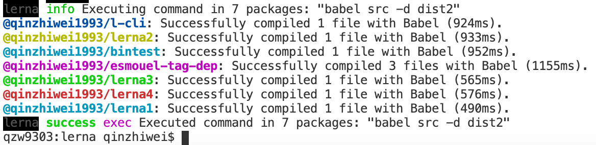

# lerna

Lerna 是一个工具，它优化了使用 git 和 npm 管理多包存储库的工作流

## 背景

1.将一个大的 package 分割成一些小的 packcage 便于分享

2.在多个 git 仓库中更改容易变得混乱且难以跟踪

3.在多个 git 仓库中维护测试繁琐

## 优点

- 各个包相互独立，便于发版、分享
- 在同一个存储库便于调试

---

## 两种工作模式

### Fixed/Locked mode (default)

vue,babel 都是用这种，在 publish 的时候,所有的包版本都会更新，并且包的版本都是一致的，版本号维护在 lerna.jon 的 version 中

### Independent mode

`lerna init --independent`

独立模式，每个 package 都可以有自己的版本号。版本号维护在各自 package.json 的 version 中。每次发布前都会提示已经更改的包，以及建议的版本号或者自定义版本号。这种方式相对第一种来说，更灵活

## 初始化项目

```javascript
npm install -g lerna // 这里是全局安装，也可以安装为项目开发依赖，使用全局方便后期使用命令行
mkdir lerna-repo
cd lerna-repo
lerna init // 初始化一个lerna项目结构，如果希望各个包使用单独版本号可以加 -i | --independent
```

## 标准的 lerna 目录结构

- 每个单独的包下都有一个 package.json 文件
- 如果包名是带 scope 的，例如@test/lerna，package.json 中，必须配置"publishConfig": {"access": "public"}

```
my-lerna-repo/
  package.json
  lerna.json
  LICENSE
  packages/
    package-1/
      package.json
    package-2/
      package.json
```

## 启用 yarn Workspaces （强烈建议）

Workspaces can only be enabled in private projects.

默认是 npm, 每个子 package 下都有自己的 node_modules，通过这样设置后，会把所有的依赖提升到顶层的 node_modules 中，并且在 node_modules 中链接本地的 package，便于调试

**注意**：必须是 private 项目才可以开启 workspaces

```json
// package.json

"private": true,
  "workspaces": [
    "packages/*"
  ],

// lerna.json

"useWorkspaces": true,
"npmClient": "yarn",
```

## 常用命令

### [lerna init](https://github.com/lerna/lerna/blob/master/commands/init#readme)

初始化 lerna 项目

- -i, --independent 独立版本模式

### [lerna create <name> [loc]](https://github.com/lerna/lerna/blob/master/commands/create#readme)

创建一个 packcage

- `--access` When using a scope, set publishConfig.access value [可选值: "public", "restricted"][默认值: public]
- `--bin` Package has an executable. Customize with --bin <executableName>
- `--description` Package description [字符串]
- `--dependencies` A list of package dependencies [数组]
- `--es-module` Initialize a transpiled ES Module [布尔]
- `--homepage` The package homepage, defaulting to a subpath of the root pkg.homepage [字符串]
- `--keywords` A list of package keywords [数组]
- `--license` The desired package license (SPDX identifier) [字符串][默认值: isc]
- `--private` Make the new package private, never published to any external registry [布尔]
- `--registry` Configure the package's publishConfig.registry [字符串]
- `--tag` Configure the package's publishConfig.tag [字符串]
- `-y, --yes` Skip all prompts, accepting default values [布尔]


### [lerna add](https://github.com/lerna/lerna/tree/master/commands/add#readme)

为匹配的package添加本地或者远程依赖，一次只能添加一个依赖

```sh
$ lerna add <package>[@version] [--dev] [--exact] [--peer]
```

运行该命令时做的事情:

1. 为匹配到的package添加依赖
2. 更改每个package下的package.json中的依赖项属性


#### Command Options

以下几个选项的含义和`npm install`时一致
- `--dev`
- `--exact`
- `--peer`
- `--registry <url>`
- `--no-bootstrap`  跳过 `lerna bootstrap`，只在更改对应的package的package.json中的属性

[`所有的过滤选项都支持`](#过滤选项)

## Examples

```sh
# Adds the module-1 package to the packages in the 'prefix-' prefixed folders
lerna add module-1 packages/prefix-*

# Install module-1 to module-2
lerna add module-1 --scope=module-2

# Install module-1 to module-2 in devDependencies
lerna add module-1 --scope=module-2 --dev

# Install module-1 to module-2 in peerDependencies
lerna add module-1 --scope=module-2 --peer

# Install module-1 in all modules except module-1
lerna add module-1

# Install babel-core in all modules
lerna add babel-core
```


### [lerna bootstrap](https://github.com/lerna/lerna/blob/master/commands/bootstrap#readme)

将本地 package 链接在一起并安装依赖

执行该命令式做了一下四件事：

1.为每个 package 安装依赖 2.链接相互依赖的库到具体的目录，例如：如果 lerna1 下有 lerna2，且版本刚好为本地版本，那么会在 node_modules 中链接本地项目，如果版本不满足，需按正常依赖安装 3.在 bootstraped packages 中 执行 `npm run prepublish` 4.在 bootstraped packages 中 执行 `npm run prepare`

#### Command Options

- `--hoist` 匹配 [glob] 依赖 提升到根目录 [默认值: '**'], 包含可执行二进制文件的依赖项还是必须安装在当前 package 的 node_modules 下，以确保 npm 脚本的运行
- `--nohoist` 和上面刚好相反 [字符串]
- `--ignore-prepublish` 在 bootstraped packages 中不再运行 prepublish 生命周期中的脚本 [布尔]
- `--ignore-scripts` 在 bootstraped packages 中不再运行任何生命周期中的脚本 [布尔]
- `--npm-client` 使用的 npm 客户端(npm, yarn, pnpm, ...) [字符串]
- `--registry` 为 npm 设置 registry [字符串]
- `--strict` 在 bootstrap 的过程中不允许发出警告，避免花销更长的时间或者导致其他问题 [布尔]
- `--use-workspaces` 启用 yarn 的 workspaces 模式 [布尔]
- `--force-local` 无论版本范围是否匹配，强制本地同级链接 [布尔] ?
- `--contents` 子目录用作任何链接的源。必须适用于所有包装 [字符串][默认值: .] ?


### [lerna link](https://github.com/lerna/lerna/tree/master/commands/link#readme)

将本地相互依赖的package相互连接。例如lerna1依赖lerna2，且版本号刚好为本地的lerna2，那么会在lerna1下node_modules中建立软连指向lerna2

#### Command Options

- --force-local 无论本地package是否满足版本需求，都链接本地的


```json
// 指定软链到package的特定目录
"publishConfig": {
    "directory": "dist" // bootstrap的时候软链package下的dist目录 package-1/dist => node_modules/package-1
  }
```


### [lerna list](https://github.com/lerna/lerna/tree/master/commands/list#readme)

#### list子命令

- `lerna ls`: 等同于 `lerna list`本身，输出项目下所有的package
- `lerna ll`: 输出项目下所有package名称、当前版本、所在位置
- `lerna la`: 输出项目下所有package名称、当前版本、所在位置，包括private package

#### Command Options

- [`--json`](#--json)
- [`--ndjson`](#--ndjson)
- [`-a`, `--all`](#--all)
- [`-l`, `--long`](#--long) 
- [`-p`, `--parseable`](#--parseable)
- [`--toposort`](#--toposort)
- [`--graph`](#--graph)

[`所有的过滤选项都支持`](#过滤选项)

##### `--json`

以json形式展示

```sh
$ lerna ls --json
[
  {
    "name": "package-1",
    "version": "1.0.0",
    "private": false,
    "location": "/path/to/packages/pkg-1"
  },
  {
    "name": "package-2",
    "version": "1.0.0",
    "private": false,
    "location": "/path/to/packages/pkg-2"
  }
]
```

#### `--ndjson`

以[newline-delimited JSON](http://ndjson.org/)展示信息

```sh
$ lerna ls --ndjson
{"name":"package-1","version":"1.0.0","private":false,"location":"/path/to/packages/pkg-1"}
{"name":"package-2","version":"1.0.0","private":false,"location":"/path/to/packages/pkg-2"}
```

#### `--all`

Alias: `-a`

显示默认隐藏的private package

```sh
$ lerna ls --all
package-1
package-2
package-3 (private)
```

#### `--long`

Alias: `-l`

显示包的版本、位置、名称

```sh
$ lerna ls --long
package-1 v1.0.1 packages/pkg-1
package-2 v1.0.2 packages/pkg-2

$ lerna ls -la
package-1 v1.0.1 packages/pkg-1
package-2 v1.0.2 packages/pkg-2
package-3 v1.0.3 packages/pkg-3 (private)
```

#### `--parseable`

Alias: `-p`

显示包的绝对路径

In `--long` output, each line is a `:`-separated list: `<fullpath>:<name>:<version>[:flags..]`

```sh
$ lerna ls --parseable
/path/to/packages/pkg-1
/path/to/packages/pkg-2

$ lerna ls -pl
/path/to/packages/pkg-1:package-1:1.0.1
/path/to/packages/pkg-2:package-2:1.0.2

$ lerna ls -pla
/path/to/packages/pkg-1:package-1:1.0.1
/path/to/packages/pkg-2:package-2:1.0.2
/path/to/packages/pkg-3:package-3:1.0.3:PRIVATE
```

#### `--toposort`

按照拓扑顺序(dependencies before dependents)对包进行排序，而不是按目录对包进行词法排序。

```sh
$ json dependencies <packages/pkg-1/package.json
{
  "pkg-2": "file:../pkg-2"
}

$ lerna ls --toposort
package-2
package-1
```

#### `--graph`

将依赖关系图显示为JSON格式的邻接表 [adjacency list](https://en.wikipedia.org/wiki/Adjacency_list).

```sh
$ lerna ls --graph
{
  "pkg-1": [
    "pkg-2"
  ],
  "pkg-2": []
}

$ lerna ls --graph --all
{
  "pkg-1": [
    "pkg-2"
  ],
  "pkg-2": [
    "pkg-3"
  ],
  "pkg-3": [
    "pkg-2"
  ]
}
```

### [lerna changed](https://github.com/lerna/lerna/tree/master/commands/changed#readme)

列出自上次发布（打tag）以来本地发生变化的package


**注意:** `lerna publish`和`lerna version`的`lerna.json`配置同样影响`lerna changed`。 例如 `command.publish.ignoreChanges`.

#### Command Options

`lerna changed` 支持 [`lerna ls`](https://github.com/lerna/lerna/tree/master/commands/list#options)的所有标记：

- [`--json`](https://github.com/lerna/lerna/tree/master/commands/list#--json)
- [`--ndjson`](https://github.com/lerna/lerna/tree/master/commands/list#--ndjson)
- [`-a`, `--all`](https://github.com/lerna/lerna/tree/master/commands/list#--all)
- [`-l`, `--long`](https://github.com/lerna/lerna/tree/master/commands/list#--long)
- [`-p`, `--parseable`](https://github.com/lerna/lerna/tree/master/commands/list#--parseable)
- [`--toposort`](https://github.com/lerna/lerna/tree/master/commands/list#--toposort)
- [`--graph`](https://github.com/lerna/lerna/tree/master/commands/list#--graph)

lerna不支持[过滤选项](https://www.npmjs.com/package/@lerna/filter-options), 因为`lerna version` or `lerna publish`不支持过滤选项.

`lerna changed` 支持 [`lerna version`](https://github.com/lerna/lerna/tree/master/commands/version#options) (the others are irrelevant)的过滤选项：

- [`--conventional-graduate`](https://github.com/lerna/lerna/tree/master/commands/version#--conventional-graduate).
- [`--force-publish`](https://github.com/lerna/lerna/tree/master/commands/version#--force-publish).
- [`--ignore-changes`](https://github.com/lerna/lerna/tree/master/commands/version#--ignore-changes).
- [`--include-merged-tags`](https://github.com/lerna/lerna/tree/master/commands/version#--include-merged-tags).


### `lerna version`


### [lerna import](https://github.com/lerna/lerna/tree/master/commands/import#readme)

`lerna import <path-to-external-repository>`

将现有的package收集到lerna项目中。可以保留之前的原始提交作者，日期和消息将保留。 

**注意**：如果要在一个新的lerna中引入，必须至少有个commit

#### Command Options

- `--flatten` 处理合并冲突
- `--dest` 指定引入包的目录
- `--preserve-commit` 保持引入项目原有的提交者信息

### [lerna clean](https://github.com/lerna/lerna/tree/master/commands/clean#readme)

`lerna clean`

移除所有packages下的node_modules，并不会移除根目录下的
[`所有的过滤选项都支持`](#过滤选项)

### [lerna diff](https://github.com/lerna/lerna/tree/master/commands/diff#readme)

查看自上次发布（打tag）以来某个package或者所有package的变化

```sh
$ lerna diff [package]

$ lerna diff
# diff a specific package
$ lerna diff package-name
```

> Similar to `lerna changed`. This command runs `git diff`.


### [lerna exec](https://github.com/lerna/lerna/tree/master/commands/exec#readme)

在每个package中执行任意命令，用波折号(`--`)分割命令语句

#### 使用方式

```sh
$ lerna exec -- <command> [..args] # runs the command in all packages
$ lerna exec -- rm -rf ./node_modules
$ lerna exec -- protractor conf.js
```

可以通过`LERNA_PACKAGE_NAME`变量获取当前package名称：

```sh
$ lerna exec -- npm view \$LERNA_PACKAGE_NAME
```

也可以通过`LERNA_ROOT_PATH`获取根目录绝对路径：

```sh
$ lerna exec -- node \$LERNA_ROOT_PATH/scripts/some-script.js
```

#### Command Options

[`所有的过滤选项都支持`](#过滤选项)

```sh
$ lerna exec --scope my-component -- ls -la
```

> 使用给定的数量进行并发执行(除非指定了 `--parallel`)。
> 输出是经过管道过滤，存在不确定性。
> 如果你希望命令一个接着一个执行，可以使用如下方式：

```sh
$ lerna exec --concurrency 1 -- ls -la
```

- `--stream`

从子进程立即输出，前缀是包的名称。该方式允许交叉输出：

```sh
$ lerna exec --stream -- babel src -d lib
```



- `--parallel`

Similar to `--stream`, but completely disregards concurrency and topological sorting, running a given command or script immediately in all matching packages with prefixed streaming output. This is the preferred flag for long-running processes such as `babel src -d lib -w` run over many packages.

```sh
$ lerna exec --parallel -- babel src -d lib -w
```

> **Note:** It is advised to constrain the scope of this command when using
> the `--parallel` flag, as spawning dozens of subprocesses may be
> harmful to your shell's equanimity (or maximum file descriptor limit,
> for example). YMMV

- `--no-bail`

```sh
# Run a command, ignoring non-zero (error) exit codes
$ lerna exec --no-bail <command>
```

By default, `lerna exec` will exit with an error if _any_ execution returns a non-zero exit code.
Pass `--no-bail` to disable this behavior, executing in _all_ packages regardless of exit code.

- `--no-prefix`

Disable package name prefixing when output is streaming (`--stream` _or_ `--parallel`).
This option can be useful when piping results to other processes, such as editor plugins.

- `--profile`

Profiles the command executions and produces a performance profile which can be analyzed using DevTools in a
Chromium-based browser (direct url: `devtools://devtools/bundled/devtools_app.html`). The profile shows a timeline of
the command executions where each execution is assigned to an open slot. The number of slots is determined by the
`--concurrency` option and the number of open slots is determined by `--concurrency` minus the number of ongoing
operations. The end result is a visualization of the parallel execution of your commands.

The default location of the performance profile output is at the root of your project.

```sh
$ lerna exec --profile -- <command>
```

> **Note:** Lerna will only profile when topological sorting is enabled (i.e. without `--parallel` and `--no-sort`).

- `--profile-location <location>`

You can provide a custom location for the performance profile output. The path provided will be resolved relative to the current working directory.

```sh
$ lerna exec --profile --profile-location=logs/profile/ -- <command>
```


### 过滤选项

- `--scope` 为匹配到的 package 安装依赖 [字符串]
- `--ignore` 和上面正相反 [字符串]
- `--no-private` 排除 private 的 packcage
- `--since` 包含从指定的[ref]依赖改变的 packages，如果没有[ref]，默认是最近的 tag ?
- `--exclude-dependents` 当使用—since 运行命令时，排除所有传递依赖项，覆盖默认的“changed”算法 [布尔] ?
- `--include-dependents` 启动命令式包含所有传递的依赖项，无视 --scope, --ignore, or --since [布尔] ?
- `--include-dependencies` 启动命令式包含所有传递的依赖项，无视 --scope, --ignore, or --since [布尔] ?
- `--include-merged-tags` 在使用—since 运行命令时，包含来自合并分支的标记 [布尔] ?